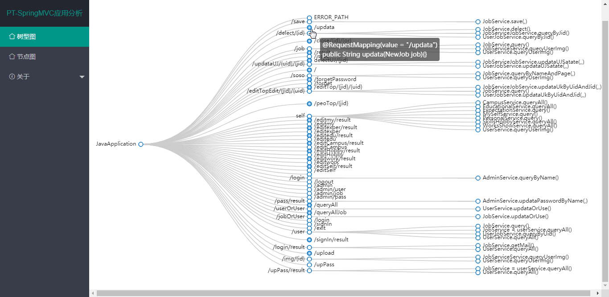
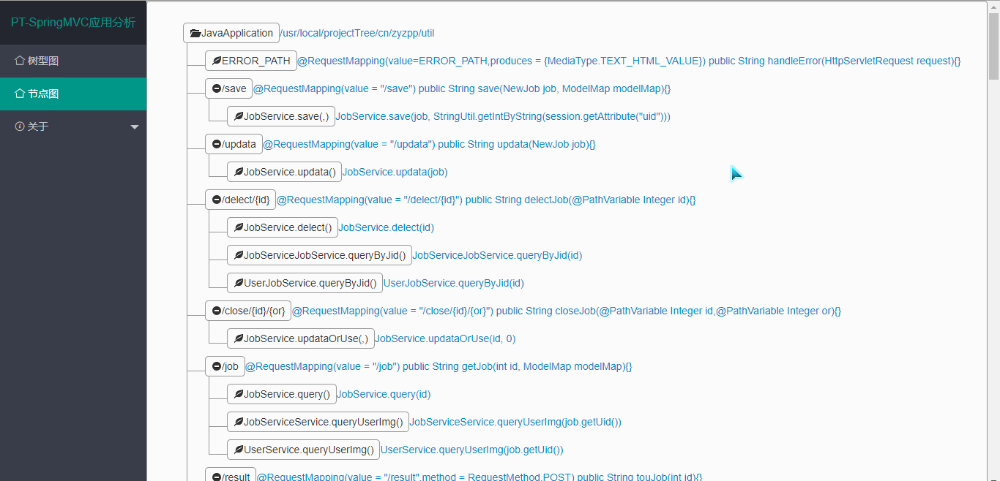

# 简介

很多新人进入一家新公司后，最头疼的就是如何快速了解公司的业务和项目架构。


因为文档很少，没有文档，或者是文档严重落伍， 根本没法看；如果你碰到一个特别热心的老员工，事无巨细地给你讲，随时在你身边答疑解惑， 那简直是天大的好运气， 现实是大家都很忙，没人给你讲解。


很快就要深入项目做开发了，怎么办呢？


我在加入新公司后，就遇到了悲催的情况。而且在一个多月时间里，我依旧没有熟悉项目细节。于是，我连夜做了这款可视化工具！帮助更多像我新人快速熟悉项目代码！
# 预览



使用树形图的方式，通过鼠标放大、缩小、移动，方便直观的查看MVC项目从Controller接口到底层业务逻辑之间的调用。



第二种方式是通过树形节点的方式展示代码运行流程。

# 展望

1.增加更多代码信息预览

2.增加更多交互功能

# 下载

发行版（releases）

# 执行

```
java -jar projecttree-x.x.x-SNAPSHOT.jar --pt=D:\src\main\java
```
--pt 追加本地项目包所在路径

# 反馈

由于作者水平有限，系统一定存在一些漏洞或不足，希望各位专家、大佬提出批评指正！

联系邮箱：yster@foxmail.com

作者博客：http://www.yueshutong.cn

Github：https://github.com/yueshutong/ProjectTree

Gitee：https://gitee.com/zyzpp/ProjectTree